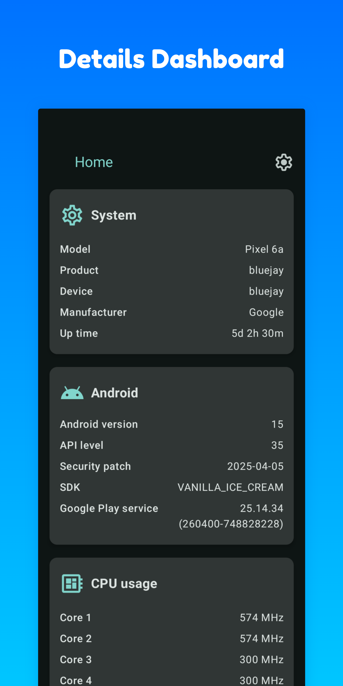
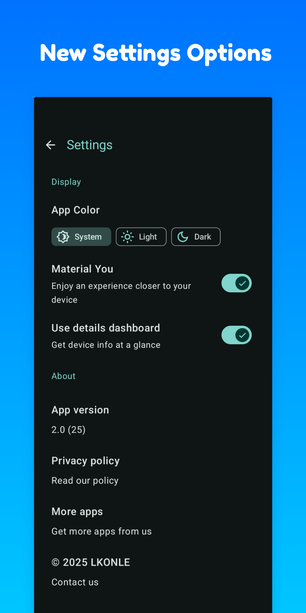
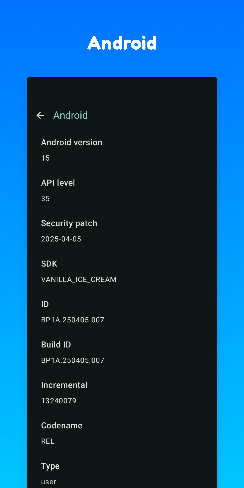
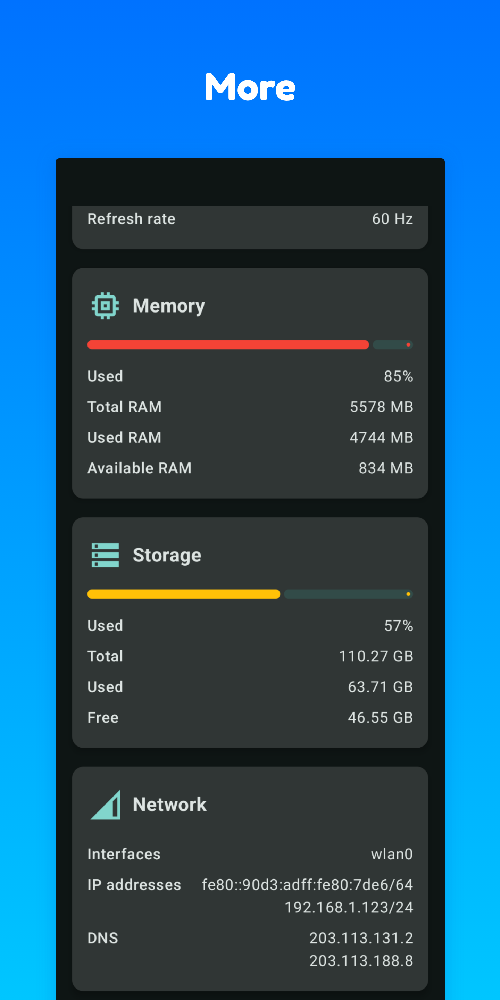
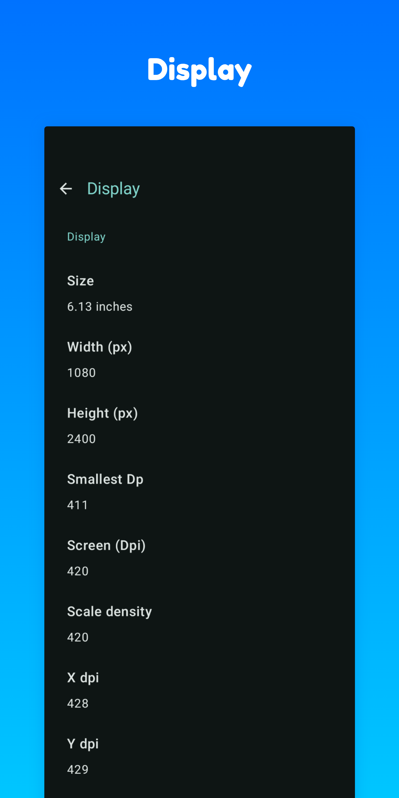
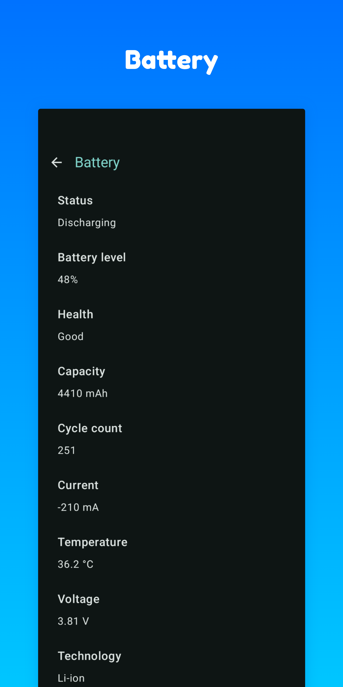
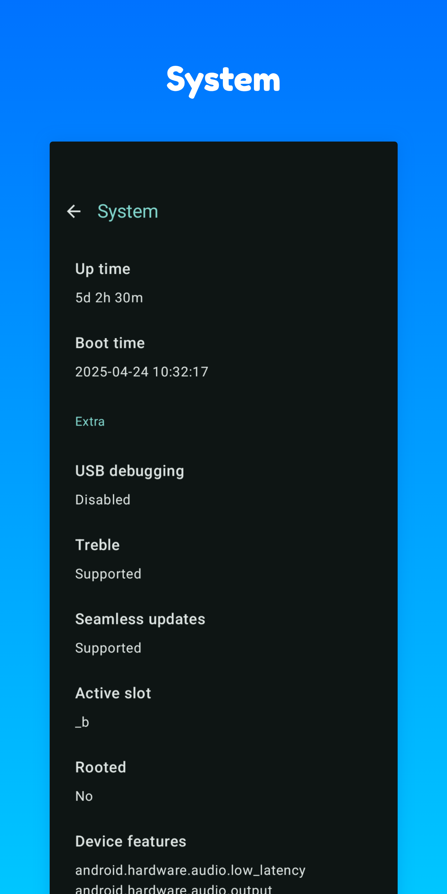

# System Info
Repository of System Info app

## App Info
System Info is a simple Android app built with [Jetpack Compose UI toolkit](https://developer.android.com/jetpack/compose).

## Features
Show various system information of device:
- System
- Android
- Display
- Battery
- Memory
- Network
- ...

## Screenshots
Simple and adaptive UI.

  
  
  
  
  
  
  	

## License
Read our [license](LICENSE)

