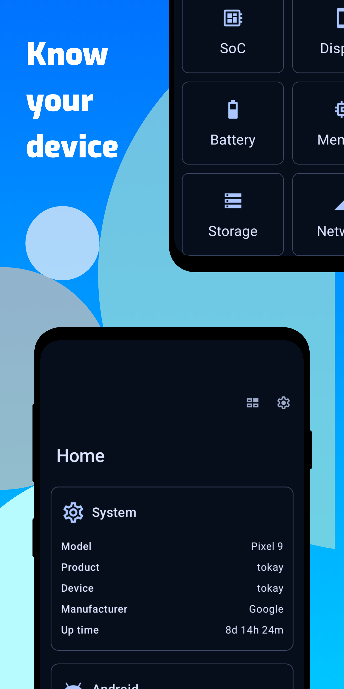
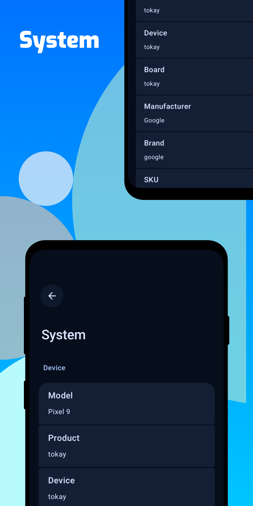
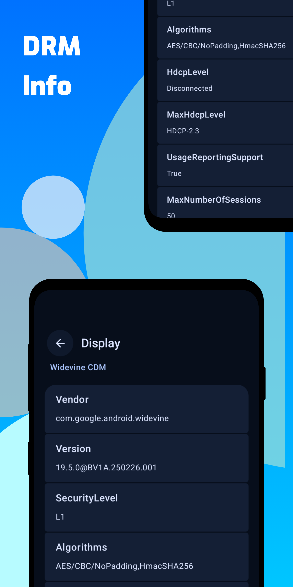
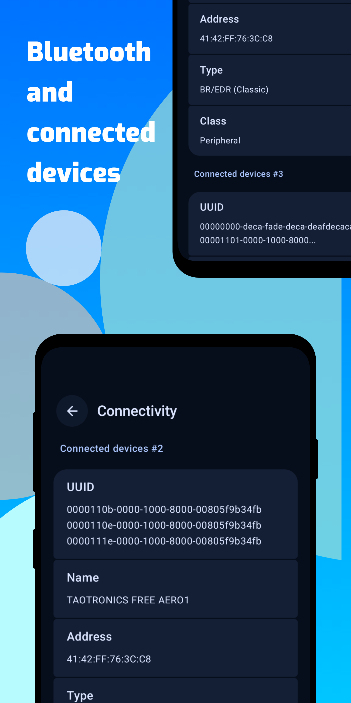
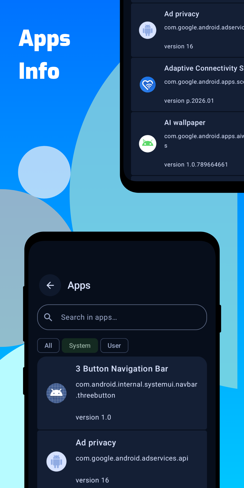
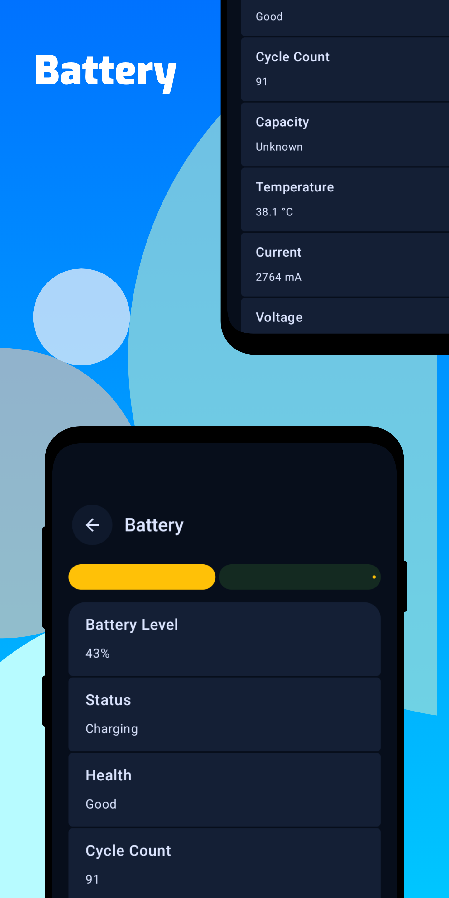

# System Info
Repository of System Info app

## App Info
System Info is a simple Android app built with [Jetpack Compose UI toolkit](https://developer.android.com/jetpack/compose).

 

## Features
Show various system information of device:
- System
- Android
- SoC/CPU
- Display
- Battery
- Memory
- Network
- Camera
- Connectivity
- DRM Information
- Root status
- More info will be added soon...

## Screenshots
Simple and adaptive UI.

  
  
  
  
  
  
  	

## Changelog
Read app [changelog](changelog.md)

## Support
You can support me by downloading this app from [Play Store](https://play.google.com/store/apps/details?id=com.lkonlesoft.displayinfo) and sharing it to your friends.

## Donate
If you like my work and want to help, buy me a coffee at [PayPal](https://paypal.me/clearall2?country.x=VN&locale.x=en_US).

© 2026 [LKONLE](mailto:lkonle@proton.me), and published to [Google Play Store](https://play.google.com/store/apps/details?id=com.lkonlesoft.displayinfo).
